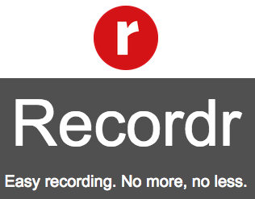
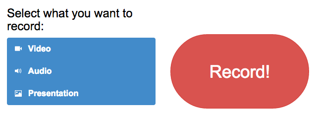
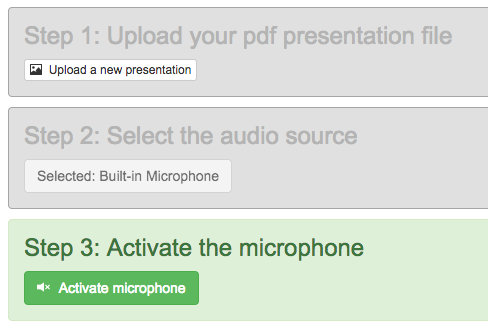
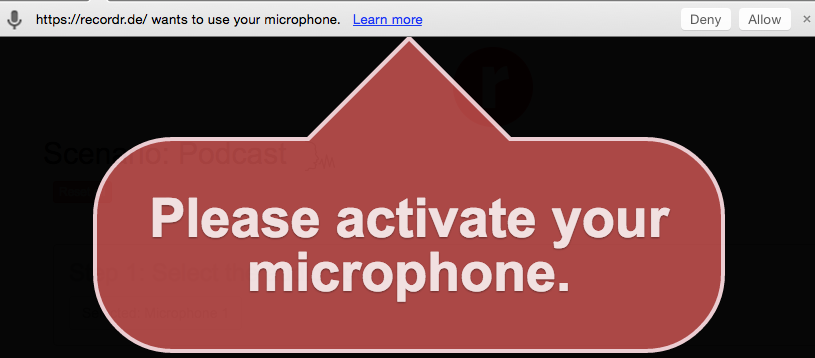
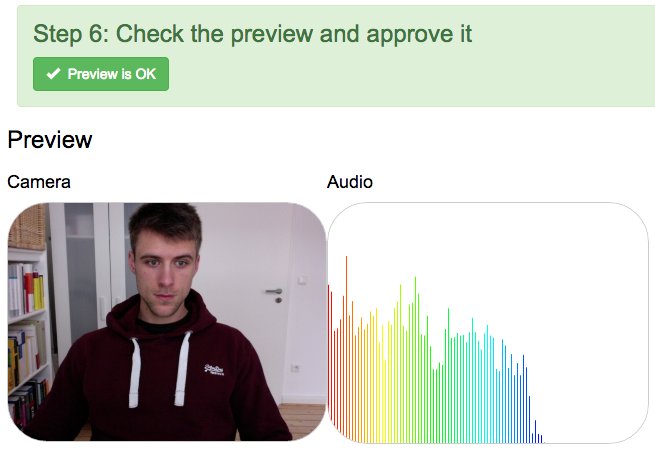
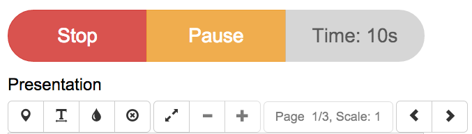
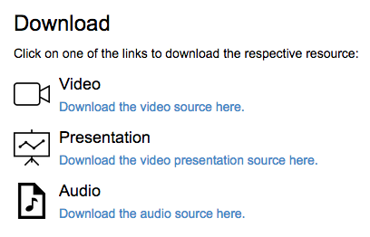

Recordr
======

Recording. No more, no less.

Recordr - Your web-based recording tool
------
Recordr is a cost-effective tool that gives you the opportunity to record on your computer everywhere you want to.
Amazing fact: It's platform independent and browser-based. You can start directly here and now without long downloads and installations.
Everything you need is a computer with a webcam, a microphone, a current browser and an internet connection. No more, no less.

You are no longer bound to locally installed software that produces its own formats and nearly exclude you from further processing. Recordr lets you freely download every single produced file in standardised output formats.
On the one hand you can process your files as you like, e.g. with other programs.
On the other hand there is the possibility to connect with your media server to automate further processing.

Features
------
- easy setup and UI
- live video
- live presentation (pdf)
- live audio visualisation
- presentation whiteboard (draw on the presentation)
- record video
- record presentation video
- record audio
- record presentation whiteboard drawings
- waveform preview of the processed audio
- video/audio synchronization
- download the processed files
- presentation mode
- directly upload to Opencast Matterhorn

Compatability
------
You need one of the current browsers because recordr uses newest web technologies. You can use one of the following browsers:
Chromium Version 33 or higher, Google Chrome Version 33 or higher or Opera Version 20 or higher.

Fully supported and successfully tested:

- Google Chrome
- 33+ `W, M`
- Chromium
- 33+ `L, M`

Not supported:

- Firefox (no webm encoding)
- All versions `W, M, L`
- Safari (no getUserMedia support)
- All versions `M`
- Opera
- 12- `W, M, L`

Not tested:

- Google Chrome (should work in Google Chrome 21+ `W, M`)
- 32- `W, M`
- Chromium (should work in Chromium 21+ `M, L`)
- 32- `L, M`
- Opera (should work in Opera 14+ `W, M, L`)
- 14+ `W, M, L`
- Internet Explorer
- All versions

---
Operating systems tested on:

- `W`indows 7+
- `M`ac OS X 10.6+
- `L`inux (Ubuntu 12+, Fedora 18+)

License
------

Copyright (c) 2014 Denis Meyer, Steffen Ottow, Benjamin Wulff

Code Copyright (c) 2014 Denis Meyer

Example scenario (steps as screenshots)
======

Step 1:
------
- Select a scenario
- Video and/or Audio and/or Presentation

Step 2:
------
- Upload a presentation file
- Activate all resources (microphone/audio and camera/video)

Step 2 (activation example):
------
- Activate microphone/audio and camera/video resources in your browser

Step 3:
------
- Check the video/audio preview and approve it

Step 4:
------
- Start recording, pause and stop it
- Draw onto the presentation, go fullscreen etc.
- A video/audio preview is on the right side

Step 5:
------
- Watch the recorded sources synchronized directly in the browser
- Download the sources
- Upload the sources to Opencast Matterhorn

